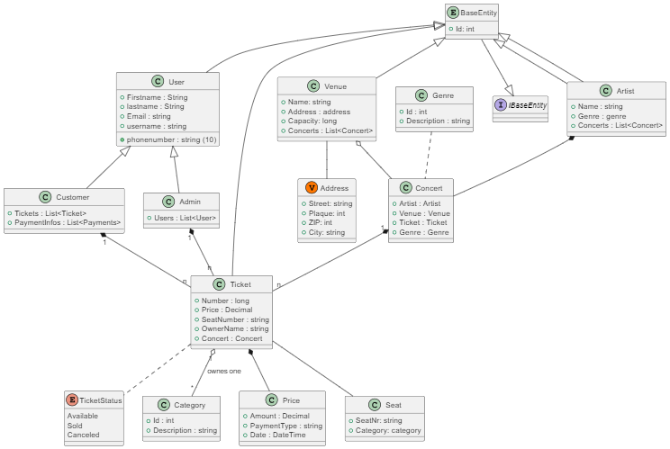

# EasyReserve
Bei diesem Projekt handelt es sich um eine Webanwendung, die für die 
Reservierung von Konzert-Tickets verwendet wird

## Tema

* Zahra LATIF
* Rafif ABUABED

@startuml 

class User {
   + Firstname : String 
   + lastname : String 
   + phonenumber : string (10)
   + Email : string 
   + username : string 
}
class Admin {
   + Users : List<User>

}
class Customer{
   + Tickets : List<Ticket>
   + PaymentInfos : List<Payments>
}
class Ticket {
   + Number : long
   + Price : Decimal
   + SeatNumber : string 
   + OwnerName : string
   + Concert : Concert
}
enum TicketStatus{
   Available
   Sold
   Canceled
}

class Category{
   + Id : int
   + Description : string
}

class Price { 
   + Amount : Decimal
   + PaymentType : string 
   + Date : DateTime
}

class Seat{
   + SeatNr: string
   + Category: category
}

class Genre{
   + Id : int
   + Description : string
}

class Artist { 
   + Name : string 
   + Genre : genre 
   + Concerts : List<Concert>
}
class Concert {
   + Artist : Artist 
   + Venue : Venue 
   + Ticket : Ticket 
   + Genre : Genre
}
class Venue {
   + Name: string
   + Address : address 
   + Capacity: long
   + Concerts : List<Concert>
}

class Address << (V, #FF7700) >> {
   + Street: string
   + Plaque: int
   + ZIP: int
   + City: string
}
Interface IBaseEntity{
}

Entity BaseEntity{
   + Id: int
}

Admin -up-|> User
Customer -up-|> User
Customer "1" *-- "n" Ticket
Artist *-- Concert
Venue o-- Concert
Venue -- Address
Genre .. Concert
Concert "1" *-- "n" Ticket
Ticket .. TicketStatus
Ticket -- Seat
Ticket *-- Price
Ticket "1" o-- "*" Category : ownes one
Admin "1" *-- "n" Ticket  
BaseEntity --|> IBaseEntity
User -up-|> BaseEntity
Artist -up-|> BaseEntity
Venue -up-|> BaseEntity
Ticket -up-|> BaseEntity
Artist -up-|> BaseEntity
@enduml